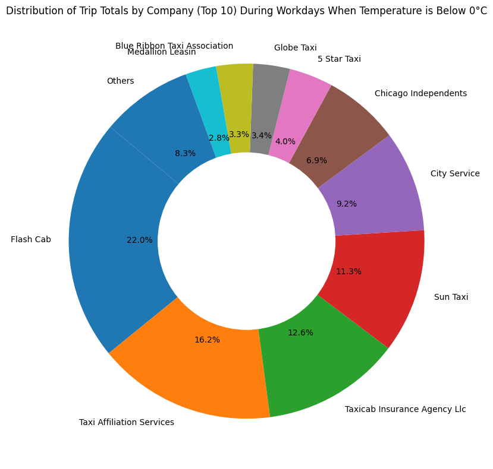

# Weather and Taxi Data Processing


## Table of Contents
- [Introduction](#introduction)
- [Features](#features)
- [Installation](#installation)
- [Usage](#usage)
- [Functions](#functions)
- [Contributing](#contributing)
- [License](#license)
- [Contact](#contact)

## Introduction

This project provides a set of functions to process and transform weather and taxi trip data, and to manage data uploads and downloads to/from AWS S3. The transformations include cleaning and preparing the data for further analysis or integration into data pipelines.

## Examples, what data the project can provide





## Features

- Retrieve and transform weather data from JSON format to a pandas DataFrame.
- Retrieve and transform taxi trip data.
- Update taxi trip data with master data for payment types and companies.
- Read and upload CSV files to/from AWS S3.
- Handle data versioning in S3.

## Installation

To get started, clone the repository and install the necessary dependencies:

```sh
git clone https://github.com/your-username/weather-taxi-data-processing.git
cd weather-taxi-data-processing
pip install -r requirements.txt
```

## Usage

Here's an example of how to use the provided functions:

```python
import json
import pandas as pd
from your_module import (
    get_taxi_data, 
    get_weather_data, 
    upload_to_s3, 
    transform_weather_data, 
    taxi_trips_transformations, 
    update_taxi_trips_with_master_data, 
    read_csv_from_s3, 
    upload_dataframe_to_s3
)

# Retrieve data
formatted_datetime = '2024-01-01'
taxi_data = get_taxi_data(formatted_datetime)
weather_data = get_weather_data(formatted_datetime)

# Upload raw data to S3
upload_to_s3(taxi_data, 'taxi_data', f'taxi_raw_{formatted_datetime}.json')
upload_to_s3(weather_data, 'weather_data', f'weather_raw_{formatted_datetime}.json')

# Transform weather data
weather_df = transform_weather_data(weather_data)

# Transform taxi trip data
taxi_trips_df = pd.DataFrame(taxi_data)
transformed_taxi_trips_df = taxi_trips_transformations(taxi_trips_df)

# Read master data from S3
bucket = 'your-s3-bucket'
payment_type_master = read_csv_from_s3(bucket, 'path_to_payment_type_master/', 'payment_type_master.csv')
company_master = read_csv_from_s3(bucket, 'path_to_company_master/', 'company_master.csv')

# Update taxi trip data with master data
updated_taxi_trips_df = update_taxi_trips_with_master_data(transformed_taxi_trips_df, payment_type_master, company_master)

# Upload the transformed data back to S3
upload_dataframe_to_s3(updated_taxi_trips_df, bucket, 'path_to_transformed_data/')
```

## Functions

### `get_taxi_data(formatted_datetime: str) -> List`

Retrieves taxi data for the given date.

### `get_weather_data(formatted_datetime: str) -> List`

Retrieves weather data for a specific datetime from the Open Meteo archive API.

### `upload_to_s3(data: List, folder_name: str, file_name: str) -> None`

Uploads data to an Amazon S3 bucket.

### `transform_weather_data(weather_data: json) -> pd.DataFrame`

Transforms weather data from JSON format to a pandas DataFrame.

### `taxi_trips_transformations(taxi_trips: pd.DataFrame) -> pd.DataFrame`

Performs transformations on a DataFrame containing taxi trip data.

### `update_taxi_trips_with_master_data(taxi_trips: pd.DataFrame, payment_type_master: pd.DataFrame, company_master: pd.DataFrame) -> pd.DataFrame`

Updates the taxi_trips DataFrame with master data for payment types and taxi companies.

### `read_csv_from_s3(bucket: str, path: str, filename: str) -> pd.DataFrame`

Reads a CSV file from an S3 bucket and returns it as a pandas DataFrame.

### `upload_dataframe_to_s3(dataframe: pd.DataFrame, bucket: str, path: str)`

Uploads a pandas DataFrame as a CSV file to an S3 bucket.

### `upload_master_data_to_s3(bucket: str, path: str, file_type: str, dataframe: pd.DataFrame)`

Uploads master data to S3, creating a backup of the previous version.

### `upload_and_move_file_on_s3(dataframe: pd.DataFrame, datetime_column: str, bucket: str, file_type: str, filename: str, source_path: str, target_path_raw: str, target_path_transformed: str)`

Uploads a DataFrame to S3 and moves the original file to a different location within the bucket.

### `lambda_handler(event, context)`

AWS Lambda function to retrieve, transform, and upload weather and taxi trip data.

## Contributing

Contributions are welcome! Please follow these steps:

1. Fork the repository.
2. Create a new branch: `git checkout -b feature/your-feature-name`
3. Make your changes and commit them: `git commit -m 'Add some feature'`
4. Push to the branch: `git push origin feature/your-feature-name`
5. Open a pull request.

Please ensure your code adheres to the existing coding conventions and has appropriate test coverage.

## License

This project is licensed under the MIT License. See the [LICENSE](LICENSE) file for details.

## Contact

Your Name - [your.email@example.com](mailto:your.email@example.com)

Project Link: [https://github.com/your-username/weather-taxi-data-processing](https://github.com/your-username/weather-taxi-data-processing)

---

Feel free to customize the README further to fit the specifics of your project!